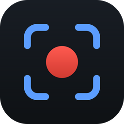
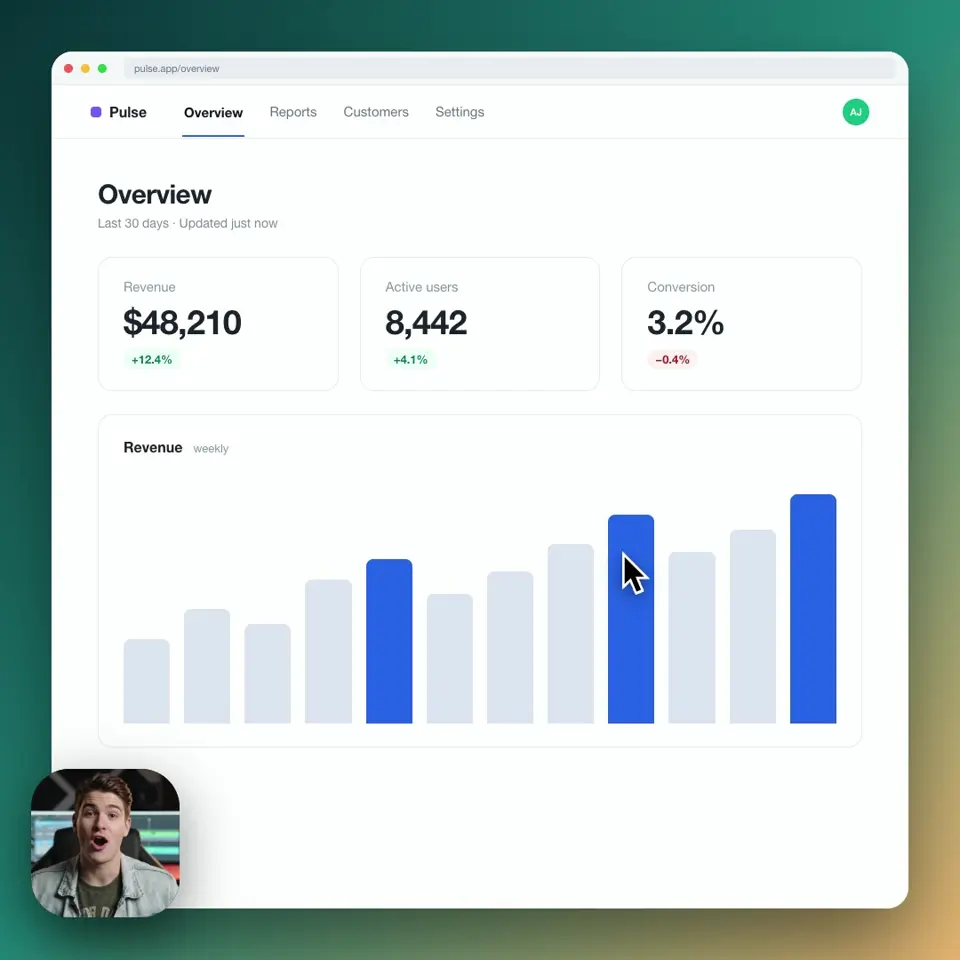
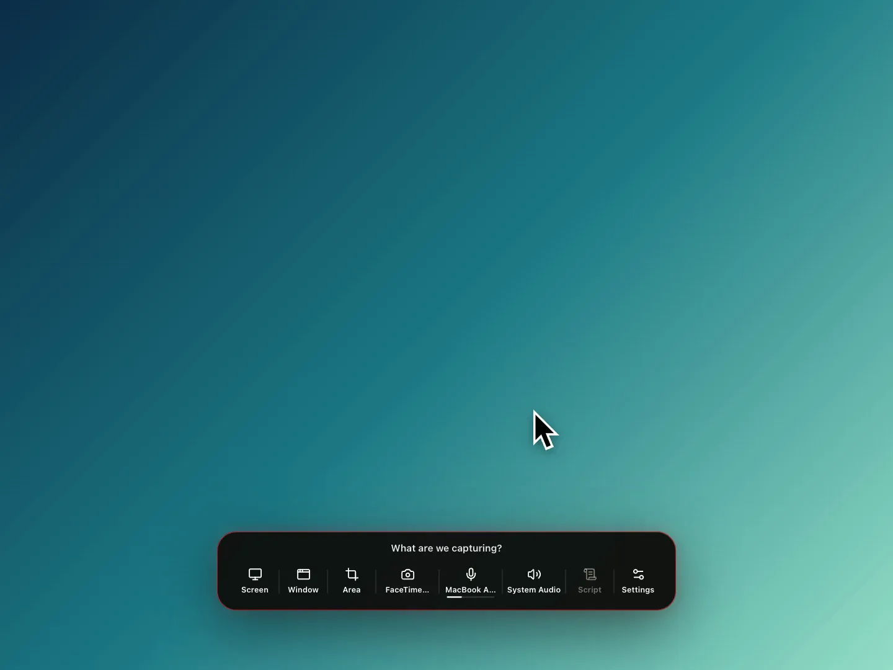
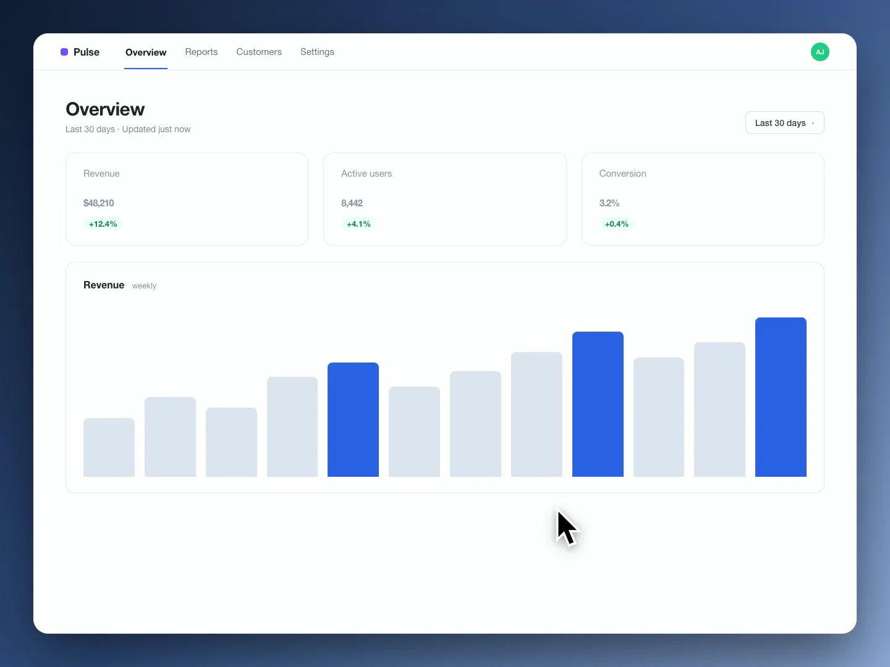
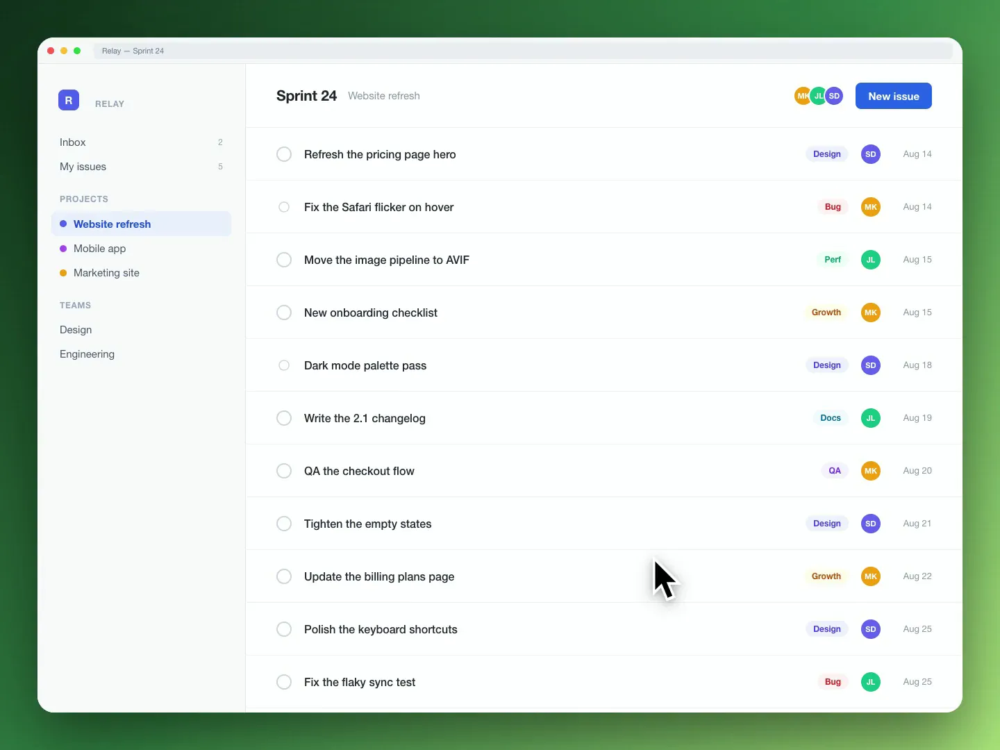
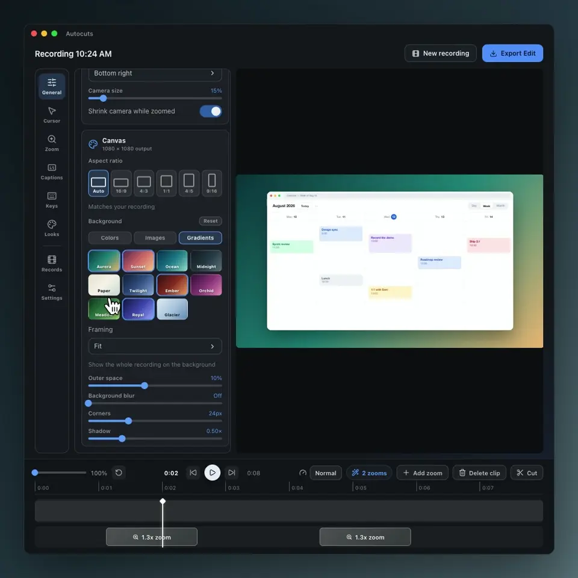
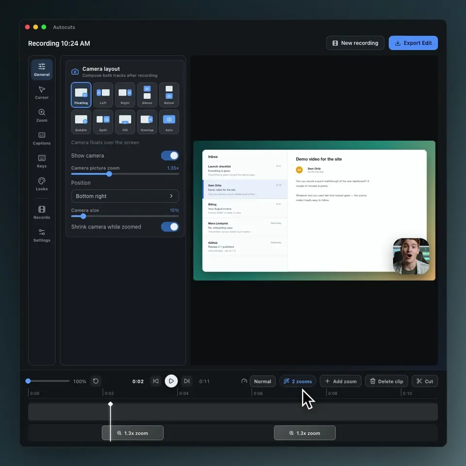
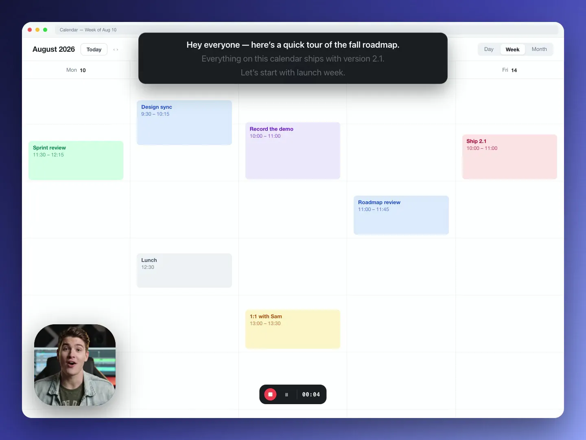
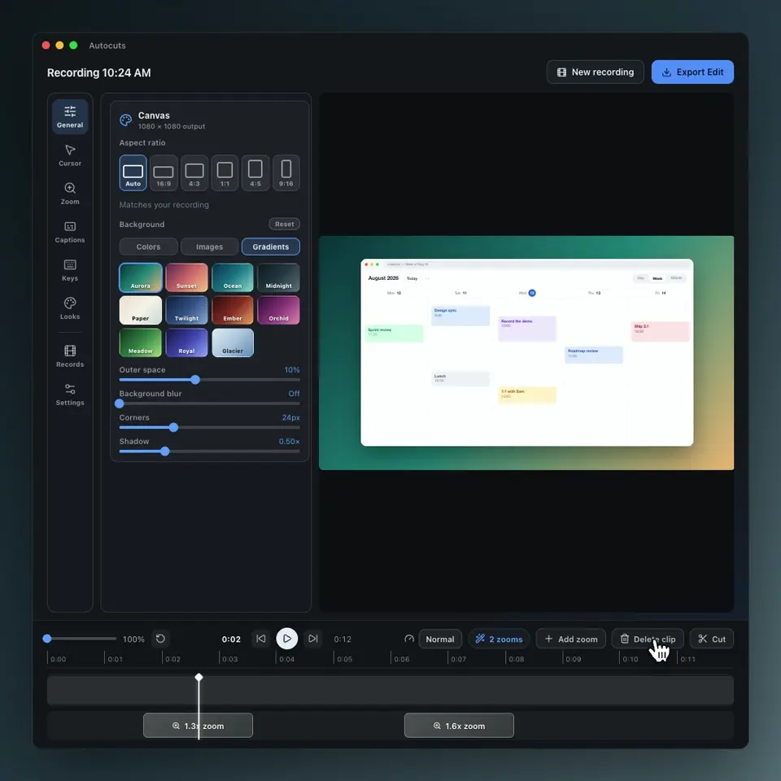

  

<h1 align="center">Just hit record. Autocuts makes it cinematic.</h1>

  Autocuts is a Mac screen recorder with automatic zoom. It records your screen, camera, 
  microphone, and system audio, then turns your clicks into zooms, smooth cursor motion, and captions.

  <a href="https://autocuts.ai/download/"><b>⬇&nbsp; Download for Mac</b></a>
  &nbsp;·&nbsp;
  <a href="https://autocuts.ai">See it live at autocuts.ai</a>

  $34.99 once, lifetime updates &nbsp;·&nbsp; Files never leave your Mac &nbsp;·&nbsp; Native on Apple Silicon

 

## See it in action

Click any clip to play it.

| | |
|:---:|:---:|
|  |  |
| **Autocuts in action** | **Record anything** |
|  |  |
| **Smart zoom follows your clicks** | **A cursor your viewers can follow** |
|  |  |
| **Backgrounds that sell the shot** | **Ten camera layouts, one click** |
|  |  |
| **A built-in teleprompter** | **The editor gives you the final say** |

## Every recording gets the full treatment

- Record your Mac screen with system audio
- Smart zoom follows your clicks
- Smooth cursor motion your viewers can follow
- Ten camera layouts, one click
- Backgrounds that sell the shot
- A built-in teleprompter
- A built-in editor for zooms, cuts, and speed
- Local-first: your recordings stay on your Mac

## Pay once. Use it forever.

  <b>LAUNCH OFFER</b> 
  <s>$75</s>&nbsp; <b>$34.99</b> one-time payment

  Every feature, no add-ons &nbsp;·&nbsp; Lifetime updates &nbsp;·&nbsp; One license covers 2 Macs &nbsp;·&nbsp; Full refund within 14 days

  <a href="https://autocuts.ai/download/"><b>⬇&nbsp; Download for Mac</b></a>

 

  <a href="https://autocuts.ai">autocuts.ai</a> · <a href="https://autocuts.ai/privacy.html">Privacy</a> · <a href="https://autocuts.ai/terms.html">Terms</a>

